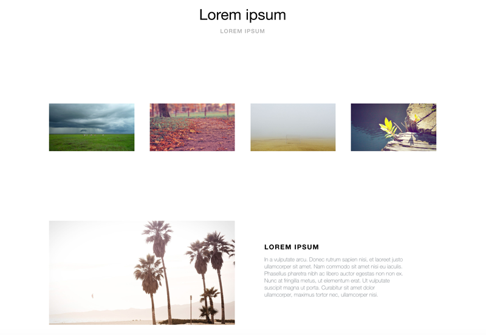
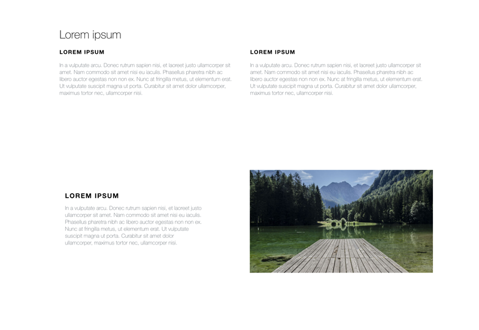

# Case Studio

An automated tool for designers to create case study pages to add to their site and effectively display their work.

## WARNING This is in the really early stages
 Case Studio is not easy to use yet! Star this repo and check back soon for 1.0 update when it will be MVP

### Create beautiful layouts

#### Copy the results to your website and show off your work

  

Sample images provided by  [Unsplash](https://unsplash.com/) via [Lorem Picsum](https://picsum.photos/)

# Prereqs

`sudo npm install --global gulp-cli`

# How to run

(the process will get better bear with me)

- compose your layout in `src/layout.json`
- add your json in the `src/content-models/` files for the layout components you used in `layouts.json`
- run `gulp` to compile less
- run `node case-studio`
- open the `index.html` file and copy it's contents and the contents  of `dest/css/main.css` to wherever you plan to use it.
(major process improvements to come including ability to use a component more than once with different data)
